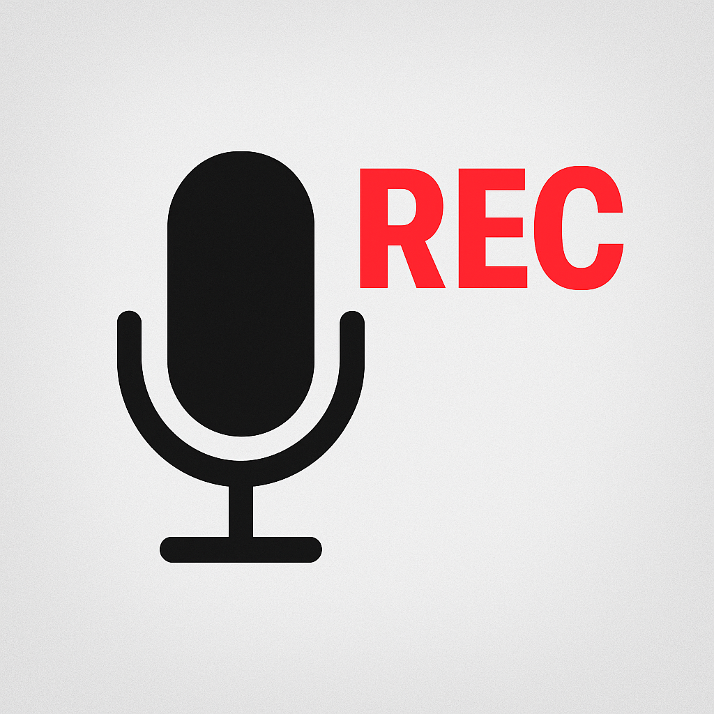

# WhisperLive Transcription

**100% Private • Lightning Fast • Runs Entirely on Your Mac**

Real-time speech-to-text for macOS. Press a hotkey, speak, and watch your words appear instantly at your cursor. No cloud, no internet required - your audio never leaves your device.

**Open source under the MIT License.**



## Quick Start

```bash
# First time setup
./run.sh --setup

# Run the app
./run.sh
```

That's it! Look for the microphone icon in your menu bar. Press `Control+Option+Space` to start/stop recording.

Need help? Run `./run.sh --help`

## Key Features

**Private by design** → Everything runs locally on your Mac. No cloud, no internet needed.

**Instant transcription** → Text appears as you speak, with minimal delay.

**Works everywhere** → Types directly at your cursor - in any app, any text field.

**Always accessible** → Lives quietly in your menu bar. Press your hotkey to start/stop recording from anywhere.

**Built for speed** → Optimized with WhisperLiveKit for real-time performance.

## Why This Instead of macOS Dictation?

The built-in dictation is fine for quick notes, but it has limitations. It stops randomly after 30-60 seconds. It needs internet for decent accuracy. And when it does work offline, the quality drops significantly.

WhisperLive runs OpenAI's Whisper models locally, giving you better accuracy without any of those restrictions. You can talk for hours if needed. It works on planes, in secure offices, anywhere.

## What About Cloud Services?

Services like Dragon, Otter.ai, or Google's transcription are accurate, but they come with trade-offs:

**Privacy**: Your audio gets uploaded and processed on their servers. Some services explicitly state they use your data for training.

**Cost**: Most charge $10-30/month. This adds up to hundreds per year.

**Latency**: Upload time means you're always waiting. WhisperLive shows text as you speak.

**Dependencies**: No internet? No transcription. Server issues? You're stuck.

## Other Local Options?

There are a few, but they typically show text in their own window after you're done speaking. WhisperLive streams text in real-time, typing directly where your cursor is - in Slack, email, code editors, anywhere.

The difference is subtle but significant when you're actually using it daily.

## Privacy & Security

**🔒 Your audio never leaves your device.** 

This app runs [WhisperLiveKit](https://github.com/QuentinFuxa/WhisperLiveKit) locally on your Mac. The Whisper AI model processes everything on-device. No internet connection needed, no data sent to OpenAI or anywhere else. 

There's no tracking, no analytics, no telemetry. Your conversations are yours alone.

## Requirements

- macOS 10.15+
- Python 3.8+
- Microphone & Accessibility permissions

## Configuration

Click the menu bar icon → Preferences to customize:
- Recording hotkey
- Whisper model (tiny/base/small)
- Text insertion method
- Audio device selection


## Development

### Running Tests

```bash
# Run all tests
python -m pytest

# Run specific test file
python -m pytest tests/unit/test_models.py

# Run specific test
python -m pytest tests/unit/test_models.py::TestAudioConfig::test_default_values

# Run with verbose output
python -m pytest -v
```

### Test Coverage

```bash
# Run with coverage (terminal report)
python -m pytest --cov=whisper_transcriber --cov-report=term-missing

# Generate HTML coverage report
python -m pytest --cov=whisper_transcriber --cov-report=html

# View HTML report
open htmlcov/index.html
```

### Test Categories

```bash
# Run only unit tests
python -m pytest -m unit

# Run only integration tests  
python -m pytest -m integration

# Exclude slow tests
python -m pytest -m "not slow"
```

### Test Configuration

- **pytest.ini**: Main pytest configuration
- **.coveragerc**: Coverage configuration  
- **pyproject.toml**: Additional tool configurations

### Important Notes

1. **whisperlivekit** folder is excluded from test discovery and coverage
2. Tests have a 10-second timeout to prevent hanging
3. Coverage files are excluded from git (`.coverage.*`)
4. Always run `pip install -r requirements.txt` to get test dependencies

## Why WhisperLiveKit is Included

WhisperLiveKit is included as a subdirectory rather than a pip dependency for several important reasons:

1. **Custom Modifications** - We've added raw PCM audio support to avoid WebM encoding/decoding overhead, significantly improving real-time performance.

2. **Tight Integration** - The transcription server is deeply integrated with our audio pipeline. Having the source code directly available allows us to optimize the connection between components.

3. **Stability** - By vendoring a specific version, we ensure the app continues to work even if upstream changes break compatibility.

4. **Easier Debugging** - When users report issues, we can debug the entire stack without jumping between repositories.

5. **Single Installation** - Users run one setup script and everything works. No need to manage multiple pip packages or worry about version conflicts.

The included version is based on the excellent work by Quentin Fuxa, with our modifications for optimal macOS performance.

## Credits

Built with [WhisperLiveKit](https://github.com/QuentinFuxa/WhisperLiveKit) by Quentin Fuxa - an excellent real-time transcription server using OpenAI's Whisper models.

## License

MIT - See [LICENSE.md](LICENSE.md)